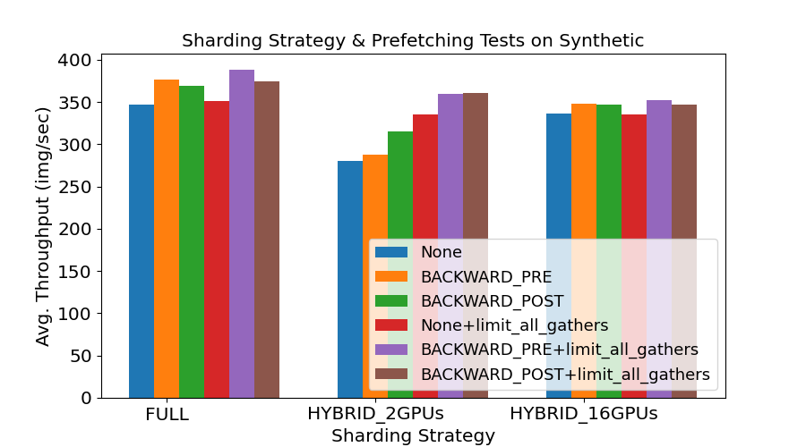
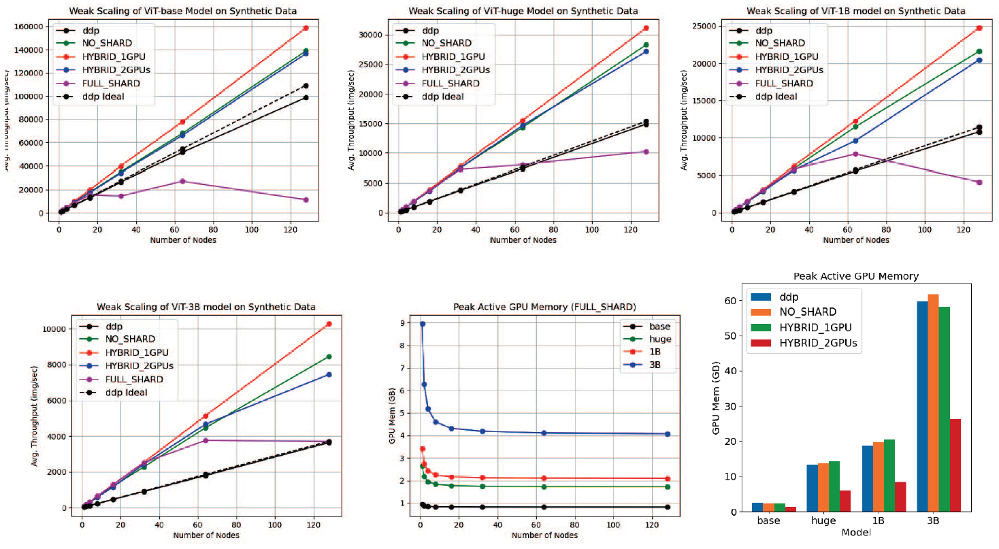
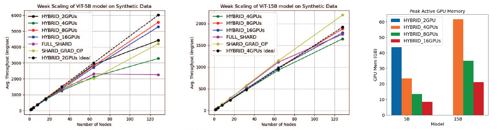

# ViT -- FSDP

This documentation shows has to run ViTs with FSDP modes on Frontier. More details can be found here [^1].

## FSDP Modes and Model Architecture Variants

Table I summarizes the different ViT variants explored in the remainder of this work. The ViT base (ViT-Base) and huge (ViT-Huge) variants follow the original vision Transformer paper [^2], with the ViT-Base containing 87M parameters, an embedding size (width) of 768, 12 encoder layers (depth), 12 heads per self-attention layer, configured with input patches 16 × 16 pixels large. For the ViT-Huge model and all listed billion-scale models, we adopt instead input patches that are 14 × 14 pixels large as per [^2].

| **Model** | **Width** | **Depth** | **MLP** | **Heads** | **Parameters [M]** |
|------------|-----------|-----------|----------|------------|--------------------|
| ViT-Base   | 768       | 12        | 3072     | 12         | 87                 |
| ViT-Huge   | 1280      | 32        | 5120     | 16         | 635                |
| ViT-1B     | 1536      | 32        | 6144     | 16         | 914                |
| ViT-3B     | 2816      | 32        | 11264    | 32         | 3067               |
| ViT-5B     | 1792      | 56        | 15360    | 16         | 5349               |
| ViT-15B    | 5040      | 48        | 20160    | 48         | 14720              |

*Table 1. Vision Transformer (ViT) Model Architectures*

Scaling studies in [^2] note that it is most effective to scale all aspects (depth, width, MLPwidth, and patch-size) by similar amounts, while [^3] performs extensive simulations to define ViT variants of different sizes. Following those empirical guides we increase the number of encoder layers and heads by gradually scaling the embedding size from 768 to 5040.

On one GPU, we can fit up to a 3B parameter ViT model. Still, the compute workload from a 100M parameter model to a 3B parameter is drastically different, such that even for models that can fit on a single GPU it is worth studying if distributing the compute to multiple GPUs will be a good trade off for the extra communication cost.

The FSDP mode equivalent to DDP is called NO SHARD, where parameters, gradients, and optimizer states are not sharded across ranks. Even though algorithmically the two approaches are the same, their implementations are different. In addition to the NO SHARD strategy, FSDP offers the FULL SHARD, SHARD GRAD OP and HYBRID SHARD. The FULL SHARD has the highest communication overhead, but produces the lowest memory footprint. It shards parameters, gradients and optimizer states across devices, offering the largest overlap between compute and communication. In contrast, the SHARD GRAD OP shards only gradients and optimizer states during computation, while the model parameters are sharded outside computation. In this sharded strategy, the communication is lighter than FULL SHARD but the memory footprint is increased. The HYBRID SHARD offers the most flexibility, since it is a hybrid strategy between model shard and model replica.

We define a strategy named HYBRID 2GPUs which applies HYBRID SHARD on a single Frontier node (i.e., 8 GPUs total) such that only the two closest GPUs perform model sharding. For a single node with 8 GPUs, such HYBRID 2GPUs strategy implies on 4 sharding-groups, each with 2 GPUs. Between the two closest GPUs, all-gather and reduce-scatter communication would occur, while the model will be replicated four times with all-reduce communication enabled for sharing parameters.

Analogously, we define a HYBRID 8GPUs strategy that allows model sharding across all 8 GPUs of a single node. For example, using HYBRID 8GPUs on two nodes allows forming 2 sharding-groups, with data-parallel performed across nodes. This mode is ideal for medium size models that can fit on a single node, reducing the communication overhead by performing only all-reduce across nodes.

## Performance Evaluations on Frontier

We show example of measuring the computational cost as we scale the ViT variants. Specifically, we report memory footprint as well as throughput by measuring images-persecond (ips) for the six ViT models described in Table I, while pursuing different FSDP-sharding strategies.

### Communication Optimizations with FSDP

We investigate different FSDP sharding strategies to understand the trade-offs between compute and communication cost. In addition to sharding options, FSDP provides several options for prefetching the parameters in the backward pass. In the None configuration, parameters for the next layer are requested after the communication calls between all FSDP ranks. In the BACKWARD POST configuration the parameters are requested also before the communication calls but before the current layer drops its parameters, while the BACKWARD PRE is even before the communication calls. Finally, FSDP also offers the limit all gathers option to synchronize the threads to prevent too many in-flight all-gathers.

<figure align="left">
  
</figure>

*Figure 1. Average image-per-second (ips) for the ViT-5B model architecture as a function of three sharding strategies for various FSDP configurations. All hyper-parameters are kept constants for the tests, with a local batch-size 32 on 8 Frontier nodes.*

Figure 1 shows the performance of three FSDP sharding strategies for the ViT-5B model for various configurations on eight nodes. Here we wanted to chose a model that can’t fit on a single GPU, to highlight more possible differences in the configuration. Overall, we observe that limit all gathers option improves throughput for most configurations, with the highest gains observed for the HYBRID 2GPUs configuration. Moreover, the BACKWARD PRE yields the highest throughput across most scenarios. This matches expectations since it provides the most overlap between compute and communication, although differences in performance are not very big. For the analysis that follows we fixed the parameters that provide us with the best image-per-second performance, i.e. BACKWARD PRE and limit all gathers.

### Weak scaling: ViT-Base to ViT-3B

Figure 2 shows the measured averaged image-per-second (ips) for the four ViT configurations of Table 1 that fit on a single GPU on Frontier. Here, we test the different sharding strategies against each other as well as against the well-established data-parallel (DDP) approach. We also evaluate the HYBRID 1GPU configuration, since although it should be equivalent with NO SHARD (sharding group is 1), their implementation PyTorch might differ and thus affect the communication and compute overlap.

<figure align="left">
  
</figure>

*Figure 2. The plots show the weak scaling for four model architectures: base (top left), huge (top center), 1B (top right) and 3B (bottom left). All four models can fit on a single GPU on Frontier. Also, the bottom center plot shows the memory usage of the FULL_SHARD mode, and the bottom right plot for the rest of the FSDP modes. The measured average image-per-second (ips) has been measured with a local batch-size of 32 for different FSDP sharding strategies as well as the distributed-data-parallel (DDP) strategy. The dash lines (ideal) show the ips drawn from an ideal linear scaling scenario without any additional costs as we scale. The memory usage per GPU for the DDP and HYBRID is constant, as we use more nodes, while the FULL sharding strategy is not.*

The peak memory usage is also shown in Figure 2. The HYBRID, DDP, and NO SHARD are constant as we use more nodes, while the FULL SHARD shards parameters across all ranks, and so it depends on the number of GPUs used. We see the ViT-3B model uses more than 60 GB of memory per GPU, while when the model is sharded on two GPUs, i.e. HYBRID 2GPUs, the memory usage is dropped in half. For the FULL SHARD we see a much bigger a drop in memory usage, up to 4 GB for the ViT-3B model, and this is expected since the model is sharded across all the available GPUs.

### Sharding Strategies for Larger ViT Models

Figure 3 shows the measured image-per-second performance for different FSDP sharding strategies for two models that do not fit on a single GPU: ViT-5B and ViT-15B. The ViT-5B can fit on two GPUs using FSDP’s model sharding, while the ViT-15B can fit on four GPUs. We used a local batch size of 32 for both models, which represents a realistic workload for production runs.

<figure align="left">
  
</figure>

*Figure 3. The plots show the weak scaling of the 5B (top left), and 15B (top center) model architectures. The 5B does not fit on a single GPU on Frontier, while the 15B needs at least 4 GPUs to fit. Also, the right and the bottom left plots show the memory usage of the HYBRID and FULL_SHARD FSDP modes respectively, for the two model architectures. The average image-per-second (ips) is measured with a local batch-size of 32 for different FSDP sharding strategies. The dash lines (ideal) show the ips drawn from an ideal linear scaling scenario without any additional costs as we scale. The memory usage for HYBRID schemes is constant as we use more nodes, while the for FULL_SHARD and SHARD_GRAD it is not.*

### Observations

The BACKWARD PRE and the limit all gathers seem to provide the best performance in terms of parameter prefetching. For models that fit on a single GPU, the best data parallel strategy seems to be the HYBRID 1GPU, where the cost of synchronization even between the closest GPUs seems to be more expensive than the saves in the compute. It is worth noting that we did not try torch.compile, which can offer additional optimizations for overlapping compute and communication costs. For models that can fit on two GPUs, model sharding within the node and data parallel all reduce across nodes seems to be the best choice. Finally, for models that can fit only on half of the Frontier node, the SHARD GRAD OP seems to scale better than any other FSDP mode. For a model detailed discussion see [^1]

## References
[^1]: Tsaris, A., Dias, P. A., Potnis, A., Yin, J., Wang, F., & Lunga, D. (2024, May). Pretraining Billion-Scale Geospatial Foundational Models on Frontier. In 2024 IEEE International Parallel and Distributed Processing Symposium Workshops (IPDPSW) (pp. 1036-1046). IEEE Computer Society.
[^2]: Alexey Dosovitskiy, Lucas Beyer, Alexander Kolesnikov, Dirk Weissenborn, Xiaohua Zhai, Thomas Unterthiner, Mostafa Dehghani, Matthias Minderer, Georg Heigold, Sylvan Gelly, et al. An image is worth 16x16 words: Transformers for image recognition at scale. In International Conference on Learning Representations, 2020.
[^3]: Xiaohua Zhai, Alexander Kolesnikov, Neil Houlsby, and Lucas Beyer. Scaling vision transformers. In Proceedings of the IEEE/CVF Conference on Computer Vision and Pattern Recognition, pages 12104–12113, 2022.
